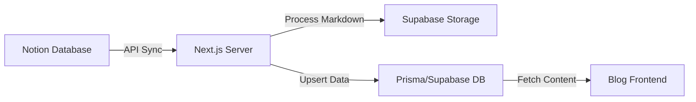

# Notion 内容同步与博客显示方案说明

本文档详细说明了 STP2026 项目中集成的 Notion 内容同步与自动化博客显示方案。

## 1. 核心架构

该方案实现了从 Notion 数据库到项目数据库（Supabase/PostgreSQL）的自动化迁移与同步。

## 2. 技术规格

- **SDK 版本**: `@notionhq/client v2.2.8` (选择此版本以确保 API 兼容性与稳定性)。
- **转换工具**: `notion-to-md` (将 Notion 区块转换为标准 Markdown)。
- **存储方案**: Supabase Storage (自动将 Notion 中的临时图片永久化)。
- **ORM**: Prisma (用于管理内容模型与分类)。

## 3. 实现细节

### 3.1 属性映射 (Mapping)
同步程序会识别 Notion 数据库中的以下字段：
- **Title**: 文章标题 (Title 类型)
- **Slug**: URL 路径 (Text 类型，同步时自动清洗斜杠)
- **Status**: 状态 (Select 类型，仅同步 `Ready` 状态的文章)
- **Category**: 分类 (Select 类型，自动触发分类索引)
- **contentMd**: (可选) 如果存在此属性，则优先从该字段读取 Markdown 内容；否则读取页面正文。
- **Cover**: 文章封面图 (Files & Media 类型)。

### 3.2 自动化处理
- **自动发布**: 同步时会将状态自动设为 `PUBLISHED`，并在网站前端即时生效。
- **图片持久化**: Notion API 返回的图片链接有有效期。同步程序会自动下载图片，上传至 Supabase 的 `media` Bucket，并替换 Markdown 中的链接。
- **Slug 清洗**: 自动去除开头多余的 `/`，确保 URL 路由符合标准。

## 4. 关键文件路径

| 功能模块 | 文件路径 |
| :--- | :--- |
| Notion 客户端配置 | [client.ts](file:///Users/apple/JSProject/STP2026/src/lib/notion/client.ts) |
| 同步核心逻辑 | [sync.ts](file:///Users/apple/JSProject/STP2026/src/lib/notion/sync.ts) |
| 图片/媒体处理 | [storage.ts](file:///Users/apple/JSProject/STP2026/src/lib/storage.ts) |
| Server Actions | [sync.actions.ts](file:///Users/apple/JSProject/STP2026/src/app/actions/sync.ts) |
| 前端数据抓取接口 | [content.ts](file:///Users/apple/JSProject/STP2026/src/lib/content.ts) |

## 5. 使用说明

1. **Notion 配置**:
   - 在 Notion 数据库中添加上述字段。
   - 在页面右上角 `...` -> `Add connections` 中邀请你的机器人。
2. **触发同步**:
   - 访问 `/admin/sync` 路径。
   - 点击“全量同步”按钮。
3. **查看效果**:
   - 同步完成后，文章会出现在首页和 `/blog` 列表页。

## 6. 常见问题排查 (Troubleshooting)

- **Synced 0 of 1 pages**: 通常是因为 `Slug` 未填或 `Status` 不是 `Ready`。
- **TypeError: notion.databases.query...**: 检查 SDK 版本是否为 v2.2.8。
- **Invalid Request URL**: 确认 `NOTION_DATABASE_ID` 是否正确且没有非法字符。
- **Database Connection Error**: 可能是 Supabase 连接池暂时过载，通常刷新或稍后重试即可。
