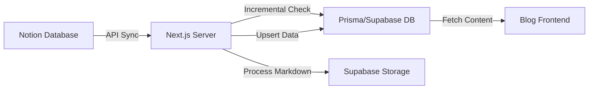

# Notion 内容同步与博客显示方案说明

本文档详细说明了 STP2026 项目中集成的 Notion 内容同步与自动化博客显示方案。

## 1. 核心架构

该方案实现了从 Notion 数据库到项目数据库（Supabase/PostgreSQL）的自动化全链条同步。

## 2. 技术规格

- **SDK 版本**: `@notionhq/client v2.x` (配置了自定义 fetch 与自动重试逻辑)。
- **转换工具**: `notion-to-md` (支持自定义图片转换器，确保链接持久化)。
- **存储方案**: Supabase Storage (处理 Notion 临时 URL，将其转换为永久存储链接)。
- **ORM**: Prisma (采用 defensive upsert 策略，处理架构迁移期间的缓存延迟)。
- **渲染引擎**: `react-markdown` + `remark-gfm` (完全支持表格、代码块及自定义图片样式)。

## 3. 实现细节

### 3.1 属性映射 (Mapping)
同步程序识别 Notion 数据库中的以下关键字段：
- **Title**: 文章标题 (Title)。
- **Slug**: URL 路径 (Text，自动清洗开头斜杠)。
- **Status**: 状态 (Select，仅同步 `Ready` 状态)。
- **Category**: 分类 (Select，支持中文，自动维护分类表)。
- **Summary**: 摘要内容 (Rich Text)。
- **ReadingTime/Minutes**: (可选) 人工设定的阅读分钟数。
- **Cover**: 文章封面 (Files & Media)。

### 3.2 性能优化：增量同步 (Incremental Sync)
为提升大规模文章下的同步速度，系统引入了增量校验：
- **逻辑**: 对比 Notion 的 `last_edited_time` 与数据库中的 `notionLastEditedAt`。
- **效果**: 仅处理发生变化的文章，大幅减少网络支出与图片上传开销。
- **强制模式**: 支持 `force=true` 参数以触发全量重刷。

### 3.3 阅读时间计算 (Reading Time)
系统通过文章内容自动估算阅读时间：
- **中日韩(CJK)**: 按 300 字符/分钟计。
- **英文(Non-CJK)**: 按 200 单词/分钟计。
- **优先级**: Notion 属性手动设定值 > 系统自动计算值。

### 3.4 API 稳定性
- **重试机制**: 对 Notion API 与外部图片下载增加了指数退避重试 (Retry Logic)。
- **请求队列**: 不同页面同步间增加 300ms 延迟，避免触发 Notion API 的 Rate Limit。

## 4. 关键文件路径

| 功能模块 | 文件路径 |
| :--- | :--- |
| Notion 客户端 & 重试配置 | [client.ts](file:///Users/apple/JSProject/STP2026/src/lib/notion/client.ts) |
| 同步核心逻辑 & 增量策略 | [sync.ts](file:///Users/apple/JSProject/STP2026/src/lib/notion/sync.ts) |
| 媒体持久化处理 | [storage.ts](file:///Users/apple/JSProject/STP2026/src/lib/storage.ts) |
| Server Actions 接口 | [sync.ts](file:///Users/apple/JSProject/STP2026/src/app/actions/sync.ts) |
| Markdown 渲染细节 | [page.tsx](file:///Users/apple/JSProject/STP2026/src/app/blog/[slug]/page.tsx) |

## 5. 管理员操作流程

1. **Notion 后台准备**:
   - 确保 `Status` 设为 `Ready`。
   - 检查 `Slug` 和 `Category` 是否已填。
2. **触发同步**:
   - 进入管理后台同步入口。
   - 系统默认执行**增量同步**。
3. **前端校验**:
   - 检查 `/blog` 列表页的阅读时间标签。
   - 检查文章详情页的排版与图片加载状态。

## 6. 常见问题排查 (Troubleshooting)

- **内容未更新**: 检查同步日志，确认为 `Comparing timestamps` 后的判断结果。若需强刷，请使用强制重连模式。
- **Prisma 数据验证错误**: 该问题通常由 Next.js 编译缓存引起。系统已内置 `as any` 绕过，若仍出现，请重启 `npm run dev` 并执行 `rm -rf .next`。
- **图片加载失败**: 确认 Supabase `media` bucket 的 RLS 策略已设为 `Public`。
- **连接重置 (ECONNRESET)**: 系统已配置自动重试，若持续发生，请检查网络代理环境。
