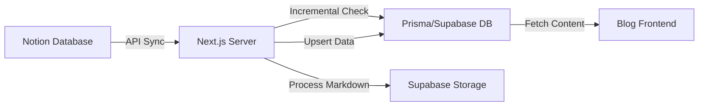

# Notion 内容同步与博客显示方案说明

本文档详细说明了 STP2026 项目中集成的 Notion 内容同步与自动化博客显示方案。

## 1. 核心架构

该方案实现了从 Notion 数据库到项目数据库（Supabase/PostgreSQL）的自动化全链条同步。

## 2. 技术规格

- **SDK 版本**: `@notionhq/client v2.x` (配置了自定义 fetch、自动重试及超长超时)。
- **转换工具**: `notion-to-md` (下行同步)；自定义 `markdownToNotionBlocks` 解析器 (上行同步)。
- **代理支持**: 基于 `undici.ProxyAgent` 的原生代理方案，适配 Node.js 18+ 的 `fetch`。
- **存储方案**: Supabase Storage (处理 Notion 临时 URL，将其转换为永久存储链接)。
- **ORM**: Prisma (采用 defensive upsert 策略，处理架构迁移期间的缓存延迟)。
- **渲染引擎**: `react-markdown` + `remark-gfm` (完全支持表格、代码块及自定义图片样式)。

## 3. 实现细节

### 3.1 属性映射 (Mapping)
同步程序识别 Notion 数据库中的以下关键字段：
- **Title**: 文章标题 (Title)。
- **Slug**: URL 路径 (Text，自动清洗开头斜杠)。
- **Status**: 状态 (Select，仅同步 `Ready` 状态)。
- **Category**: 分类 (Select，支持中文，自动维护分类表)。
- **Summary**: 摘要内容 (Rich Text)。
- **ReadingTime/Minutes**: (可选) 人工设定的阅读分钟数。
- **Cover**: 文章封面 (Files & Media)。

### 3.2 性能优化：增量同步与并发处理
- **增量同步**: 对比 Notion 的 `last_edited_time` 与数据库中的 `notionLastEditedAt`。
- **并发删除 (Batch Deletion)**: 在反向同步时，系统采用“并发批处理（每批 5 个）”的方式删除 Notion 页面中的旧 Block，相比于单步顺序删除，效率提升显著且能有效避免请求超时。
- **超长超时策略**: 为应对大型文章的 Block 处理耗时，Notion Client 的超时时间延长至 180 秒（3 分钟）。

### 3.3 双向同步 (Bi-directional Sync)
系统支持在管理后台直接编辑 Markdown 内容并实时反刷回 Notion：
- **策略**: **“清空并重写” (Clear & Rewrite)**。为保证结构一致性，系统会先并发删除 Notion 页面原有的所有 Block，然后将修改后的 Markdown 重新追加。
- **Markdown 解析支持**: 当前支持 H1-H3、段落、代码块、无序列表的完整转换。
- **风险提示**: 因 Notion Block 结构的复杂性，反向同步目前主要针对核心文本与格式，复杂的第三方嵌入块可能在同步后丢失。

### 3.4 API 稳定性与代理支持
- **原生 Fetch 代理**: 引入 `undici` 库中的 `ProxyAgent`，完美解决 Node.js 18+ 环境下 `https-proxy-agent` 失效引发的 TLS 连接重置问题。
- **环境变量控制**: 通过 `.env` 中的 `HTTPS_PROXY` 灵活配置网络环境。

## 4. 关键文件路径

| 功能模块 | 文件路径 |
| :--- | :--- |
| Notion 客户端 & 代理 & 转换解析 | [client.ts](file:///Users/apple/JSProject/STP2026/src/lib/notion/client.ts) |
| 同步核心逻辑 & 增量策略 | [sync.ts](file:///Users/apple/JSProject/STP2026/src/lib/notion/sync.ts) |
| 媒体持久化处理 | [storage.ts](file:///Users/apple/JSProject/STP2026/src/lib/storage.ts) |
| Server Actions 接口 | [content.ts](file:///Users/apple/JSProject/STP2026/src/app/actions/content.ts) |
| Markdown 渲染细节 | [page.tsx](file:///Users/apple/JSProject/STP2026/src/app/blog/[slug]/page.tsx) |

## 5. 管理员操作流程

1. **Notion 后台准备**:
   - 确保 `Status` 设为 `Ready`。
   - 检查 `Slug` 和 `Category` 是否已填。
2. **触发全量/增量同步**:
   - 点击管理后台仪表盘的“强制全量同步”或等待自动任务。
3. **后台编辑与回更**:
   - 在“内容管理”找到对应文章点击“编辑”。
   - 修改 Markdown 正文后点击“保存并反向同步”。
   - 系统将自动更新数据库并推送到 Notion 页面。

## 6. 常见问题排查 (Troubleshooting)

- **内容未更新**: 检查同步日志，确认为 `Comparing timestamps` 后的判断结果。若需强刷，请使用强制重连模式。
- **连接重置或 SSL 报错 (TLS internal error)**: 这是典型的本地网络限制。请在 `.env` 中配置 `HTTPS_PROXY`。系统现在已支持 `undici` 的原生代理分发，确保代理配置后能稳定连接。
- **响应超时 (Timeout)**: 检查 Notion 页面是否过于庞大（如包含数千个 Block）。系统已将超时延长至 3 分钟，并采用并发批处理优化，绝大多数场景应可顺畅完成。
- **图片加载失败**: 确认 Supabase `media` bucket 的 RLS 策略已设为 `Public`。
